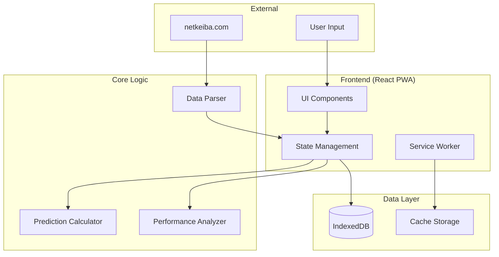
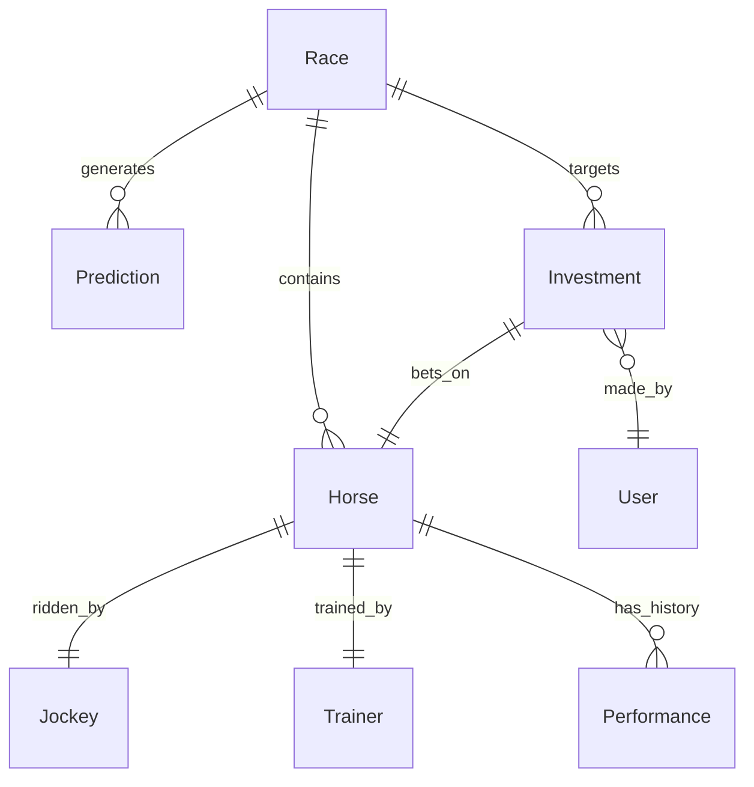

# 競馬予想アプリ設計書

## 概要

競馬予想アプリは、React + TypeScriptベースのPWAとして構築し、統計分析による期待値計算を核とした予想機能と収支管理機能を提供する。モバイルファーストのレスポンシブデザインで、オフライン対応とローカルデータ永続化を実現する。

## アーキテクチャ

### システム全体構成



### 技術スタック

**フロントエンド**

- React 18+ with TypeScript
- Vite (ビルドツール)
- Tailwind CSS + shadcn/ui (UIコンポーネント)
- Zustand (状態管理)
- Recharts (グラフ表示)

**データ永続化**

- IndexedDB (Dexie.js使用)
- Cache API (Service Worker)

**PWA機能**

- Service Worker
- Web App Manifest
- Push API (将来実装)

## コンポーネントとインターフェース

### データモデル

```typescript
// 馬情報
interface Horse {
  id: string;
  name: string;
  number: number;
  age: number;
  gender: 'male' | 'female' | 'gelding';
  weight: number;
  jockey: Jockey;
  trainer: Trainer;
  odds: {
    win: number;
    place: [number, number];
  };
  pastPerformances: Performance[];
}

// レース情報
interface Race {
  id: string;
  date: Date;
  venue: string;
  raceNumber: number;
  title: string;
  distance: number;
  surface: 'turf' | 'dirt';
  horses: Horse[];
  predictions?: Prediction[];
  result?: RaceResult;
}

// 予想結果
interface Prediction {
  horseId: string;
  baseScore: number;
  expectedValue: number;
  confidence: number;
  isRecommended: boolean;
  reasoning: string[];
}

// 投資記録
interface Investment {
  id: string;
  raceId: string;
  horseId: string;
  amount: number;
  odds: number;
  result: 'win' | 'lose' | 'pending';
  payout: number;
  date: Date;
}
```

### コアコンポーネント

**1. データ入力コンポーネント**

```typescript
interface DataInputProps {
  onRaceDataSubmit: (race: Race) => void;
  onNetKeibaDataPaste: (data: string) => void;
}

// NetKeibaパーサー
class NetKeibaParser {
  parse(rawData: string): Partial<Race>;
  validateData(race: Partial<Race>): ValidationResult;
}
```

**2. 予想計算エンジン**

```typescript
class PredictionCalculator {
  calculateBaseScore(horse: Horse, race: Race): number;
  calculateExpectedValue(horse: Horse, baseScore: number): number;
  generatePredictions(race: Race): Prediction[];
}

// 計算ロジック
interface CalculationWeights {
  pastPerformance: number;
  jockeyPerformance: number;
  distanceAptitude: number;
  venueAptitude: number;
  classAptitude: number;
}
```

**3. 収支管理コンポーネント**

```typescript
class BankrollManager {
  calculateBetSize(bankroll: number, confidence: number): number;
  checkDailyLossLimit(investments: Investment[]): boolean;
  updateBalance(investment: Investment): number;
}

interface BankrollSettings {
  initialAmount: number;
  betSizePercentage: number; // 1-5%
  dailyLossLimit: number;
  strategy: 'fixed' | 'proportional' | 'kelly';
}
```

### データアクセス層

```typescript
// IndexedDB操作
class DatabaseService {
  // レースデータ
  saveRace(race: Race): Promise<void>;
  getRace(id: string): Promise<Race | null>;
  getRacesByDateRange(start: Date, end: Date): Promise<Race[]>;

  // 馬データ
  saveHorse(horse: Horse): Promise<void>;
  getHorse(id: string): Promise<Horse | null>;
  searchHorses(name: string): Promise<Horse[]>;

  // 投資記録
  saveInvestment(investment: Investment): Promise<void>;
  getInvestmentHistory(dateRange?: [Date, Date]): Promise<Investment[]>;

  // マスターデータ
  saveJockey(jockey: Jockey): Promise<void>;
  saveTrainer(trainer: Trainer): Promise<void>;
}
```

## データモデル

### データベーススキーマ (IndexedDB)

```typescript
// Dexie.jsスキーマ定義
class HorseRacingDB extends Dexie {
  races!: Table<Race>;
  horses!: Table<Horse>;
  jockeys!: Table<Jockey>;
  trainers!: Table<Trainer>;
  investments!: Table<Investment>;
  settings!: Table<AppSettings>;

  constructor() {
    super('HorseRacingDB');
    this.version(1).stores({
      races: '++id, date, venue, raceNumber',
      horses: '++id, name, *pastRaceIds',
      jockeys: '++id, name',
      trainers: '++id, name',
      investments: '++id, raceId, horseId, date, result',
      settings: '++key',
    });
  }
}
```

### データ関係図



## エラーハンドリング

### エラー分類と対応

**1. データ入力エラー**

```typescript
class ValidationError extends Error {
  field: string;
  value: any;
  expectedFormat: string;
}

// バリデーション例
const validateHorse = (horse: Partial<Horse>): ValidationResult => {
  const errors: ValidationError[] = [];

  if (!horse.name || horse.name.trim().length === 0) {
    errors.push(new ValidationError('name', horse.name, '非空文字列'));
  }

  if (!horse.odds?.win || horse.odds.win <= 0) {
    errors.push(new ValidationError('odds.win', horse.odds?.win, '正の数値'));
  }

  return { isValid: errors.length === 0, errors };
};
```

**2. 計算エラー**

```typescript
class CalculationError extends Error {
  horseId: string;
  calculationType: 'baseScore' | 'expectedValue';
  inputData: any;
}

// エラー回復戦略
const safeCalculateExpectedValue = (
  horse: Horse,
  baseScore: number
): number => {
  try {
    return calculateExpectedValue(horse, baseScore);
  } catch (error) {
    console.error('Expected value calculation failed:', error);
    return 0; // デフォルト値
  }
};
```

**3. データベースエラー**

```typescript
class DatabaseError extends Error {
  operation: 'read' | 'write' | 'delete';
  table: string;
}

// リトライ機能付きデータベース操作
const withRetry = async <T>(
  operation: () => Promise<T>,
  maxRetries: number = 3
): Promise<T> => {
  for (let i = 0; i < maxRetries; i++) {
    try {
      return await operation();
    } catch (error) {
      if (i === maxRetries - 1) throw error;
      await new Promise(resolve => setTimeout(resolve, 1000 * (i + 1)));
    }
  }
  throw new Error('Max retries exceeded');
};
```

## テスト戦略

### テスト構成

**1. 単体テスト (Jest + Testing Library)**

```typescript
// 予想計算のテスト例
describe('PredictionCalculator', () => {
  test('基礎スコア計算が正しく動作する', () => {
    const calculator = new PredictionCalculator();
    const horse = createMockHorse();
    const race = createMockRace();

    const score = calculator.calculateBaseScore(horse, race);

    expect(score).toBeGreaterThan(0);
    expect(score).toBeLessThanOrEqual(100);
  });

  test('期待値120%以上で推奨馬となる', () => {
    const calculator = new PredictionCalculator();
    const horse = createHighExpectedValueHorse();
    const race = createMockRace();

    const predictions = calculator.generatePredictions(race);
    const prediction = predictions.find(p => p.horseId === horse.id);

    expect(prediction?.isRecommended).toBe(true);
    expect(prediction?.expectedValue).toBeGreaterThanOrEqual(1.2);
  });
});
```

**2. 統合テスト**

```typescript
// データフロー全体のテスト
describe('Data Flow Integration', () => {
  test('NetKeibaデータ入力から予想生成まで', async () => {
    const parser = new NetKeibaParser();
    const calculator = new PredictionCalculator();
    const db = new DatabaseService();

    // 1. データパース
    const raceData = parser.parse(mockNetKeibaData);
    expect(raceData.horses).toHaveLength(16);

    // 2. データ保存
    await db.saveRace(raceData as Race);

    // 3. 予想生成
    const predictions = calculator.generatePredictions(raceData as Race);
    expect(predictions).toHaveLength(16);

    // 4. 推奨馬の存在確認
    const recommended = predictions.filter(p => p.isRecommended);
    expect(recommended.length).toBeGreaterThan(0);
  });
});
```

**3. E2Eテスト (Playwright)**

```typescript
// ユーザーシナリオテスト
test('レース予想の完全フロー', async ({ page }) => {
  await page.goto('/');

  // データ入力
  await page.click('[data-testid="add-race-button"]');
  await page.fill('[data-testid="netkeiba-data"]', mockNetKeibaData);
  await page.click('[data-testid="parse-button"]');

  // 予想確認
  await expect(page.locator('[data-testid="prediction-list"]')).toBeVisible();
  await expect(
    page.locator('[data-testid="recommended-horse"]')
  ).toHaveCount.toBeGreaterThan(0);

  // 投資実行
  await page.click('[data-testid="recommended-horse"]:first-child');
  await page.fill('[data-testid="bet-amount"]', '1000');
  await page.click('[data-testid="place-bet-button"]');

  // 収支確認
  await page.click('[data-testid="portfolio-tab"]');
  await expect(page.locator('[data-testid="current-balance"]')).toContainText(
    '99,000'
  );
});
```

### パフォーマンステスト

**1. 計算速度テスト**

```typescript
test('予想計算が3秒以内に完了する', async () => {
  const calculator = new PredictionCalculator();
  const race = createLargeRace(16); // 16頭立て

  const startTime = performance.now();
  const predictions = calculator.generatePredictions(race);
  const endTime = performance.now();

  expect(endTime - startTime).toBeLessThan(3000);
  expect(predictions).toHaveLength(16);
});
```

**2. データベース性能テスト**

```typescript
test('大量データの読み書き性能', async () => {
  const db = new DatabaseService();
  const races = Array.from({ length: 100 }, () => createMockRace());

  // 書き込み性能
  const writeStart = performance.now();
  await Promise.all(races.map(race => db.saveRace(race)));
  const writeEnd = performance.now();

  expect(writeEnd - writeStart).toBeLessThan(5000);

  // 読み込み性能
  const readStart = performance.now();
  const retrieved = await db.getRacesByDateRange(
    new Date('2024-01-01'),
    new Date('2024-12-31')
  );
  const readEnd = performance.now();

  expect(readEnd - readStart).toBeLessThan(1000);
  expect(retrieved).toHaveLength(100);
});
```
